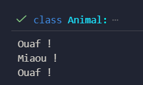
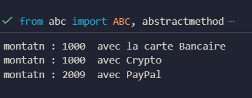

# Polymorphisme et Abstraction en Python

### Exercice 1 — Gestion des Animaux

**Objectif pédagogique**  
Explorer le polymorphisme en Python à travers l'utilisation d'interfaces communes et de substitutions dynamiques. Ce TP démontre comment plusieurs classes peuvent partager une même interface et être utilisées de façon interchangeable.

**Fonctionnalités**  
- Définir une classe de base `Animal` avec une méthode `parler()` à redéfinir dans les sous-classes.  
- Créer des classes `Chien` et `Chat` qui redéfinissent `parler()`.  
- Implémenter une fonction `faire_parler()` qui appelle `parler()` sur n'importe quel objet `Animal`.  
- Manipulation d'une liste hétérogène d'animaux pour démontrer le polymorphisme.

**Résultat**  

---

### Exercice 2 — Hiérarchie de Formes Géométriques

**Objectif pédagogique**  
Approfondir le polymorphisme en Python en créant une hiérarchie de formes capables de calculer leur aire via une interface commune. L’activité fait intervenir une classe abstraite, plusieurs spécialisations, et l’utilisation de collections hétérogènes.

**Fonctionnalités**  
- Définir une classe abstraite `Forme` avec une méthode `aire()`.  
- Créer les classes `Cercle`, `Rectangle` et `Triangle` qui implémentent `aire()` selon leur géométrie.  
- Utilisation de la méthode `__str__()` pour afficher le nom de la forme et son aire.  
- Parcours d'une collection de formes pour démontrer le polymorphisme et la substitution.

**Résultat**  

---

### Exercice 3 — Gestion de Moyens de Paiement

**Objectif pédagogique**  
- Concevoir une interface commune à plusieurs modes de paiement.  
- Appliquer le principe de substitution : un même appel `payer()` déclenche le comportement approprié selon la sous-classe.  
- Manipuler une collection hétérogène d’objets pour illustrer la souplesse du polymorphisme.

**Fonctionnalités**  
- Classe abstraite `Paiement` avec attribut protégé `montant` et méthode abstraite `payer()`.  
- Sous-classes : `CarteBancaire`, `PayPal`, `Crypto` avec leurs attributs spécifiques.  
- Fonction utilitaire `traiter_paiements()` qui parcourt une liste de paiements et affiche la confirmation pour chaque paiement.  
- Respect de la visibilité des attributs et validation des données simples (montant positif, numéro de carte).  

**Résultat**  

